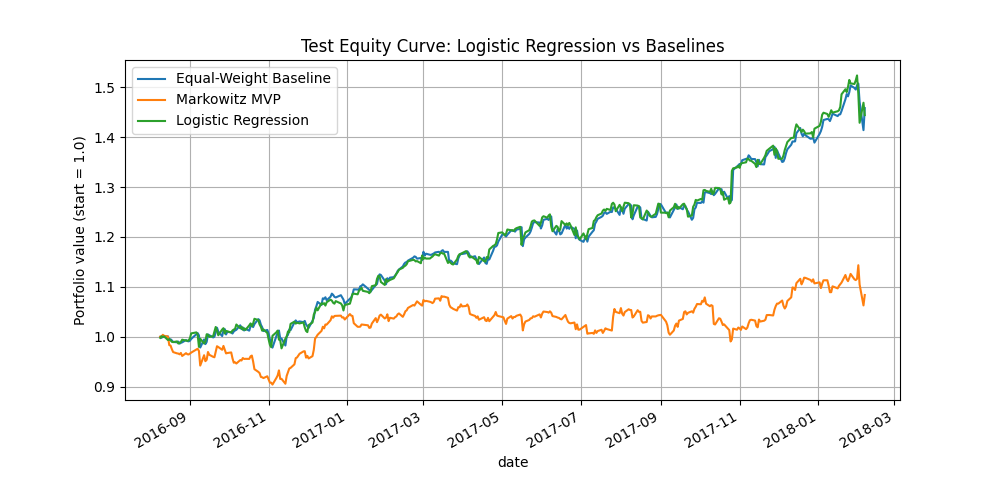
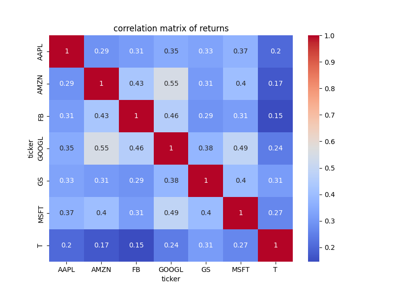
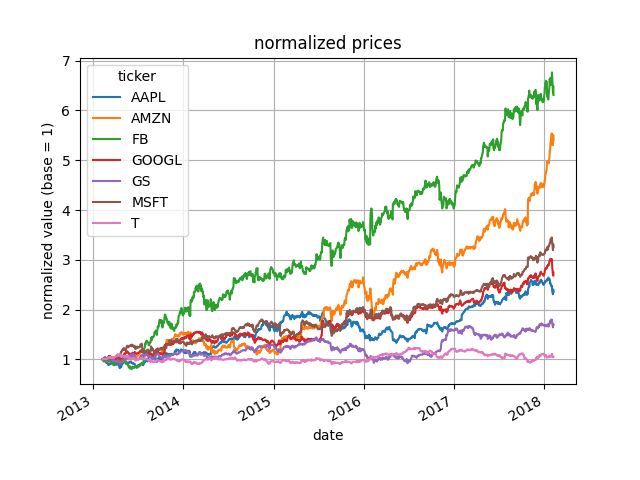
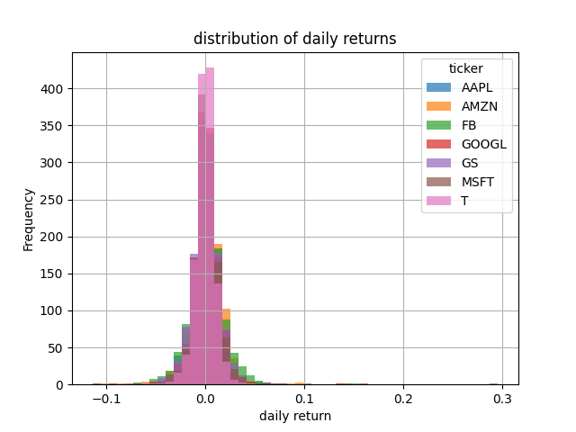

# ML Portfolio Optimization

[](https://www.python.org/)
[](LICENSE)
[](https://scikit-learn.org/)
[](https://www.esilv.fr/)
[](https://github.com/MaximeFARRE/Projet_final_ML/commits/main)

> Final Machine Learning project — ESILV, 4th year (2025–2026)

Compare classical and machine-learning-based portfolio allocation strategies on historical S&P 500 data and evaluate their risk-adjusted performance.

---

## Project Context

This project was developed as part of the Machine Learning course at **ESILV** (École Supérieure d'Ingénieurs Léonard de Vinci). The goal is to implement and benchmark several portfolio allocation strategies — from naive baselines to supervised machine learning models — on a selection of S&P 500 stocks over the 2013–2018 period.

---

## Main Features

- **Equal-Weight Baseline** — naive 1/N allocation across all assets, buy-and-hold
- **Markowitz Minimum Variance Portfolio** — classical closed-form mean-variance optimization
- **Random Forest Strategy** — per-ticker binary classifiers with probability-weighted allocation and GridSearchCV tuning
- **Logistic Regression Strategy** — similar supervised ML approach with L2 regularization
- **Technical Feature Engineering** — moving averages (20d, 60d) and rolling volatility (20d) per ticker
- **ANOVA Feature Selection** — top-k features selected per model
- **Comprehensive Evaluation** — total return, annualized Sharpe ratio, max drawdown, Calmar ratio

---

## Tech Stack

| Category               | Libraries                                       |
|------------------------|-------------------------------------------------|
| Data                   | `pandas`, `numpy`, `kagglehub`                  |
| Machine Learning       | `scikit-learn`                                  |
| Visualization          | `matplotlib`, `seaborn`                         |
| Reinforcement Learning | `stable-baselines3`, `gymnasium` (experimental) |
| Environment            | Python 3.10+                                    |

---

## Installation

```bash
# Clone the repository
git clone https://github.com/MaximeFARRE/Projet_final_ML.git
cd Projet_final_ML

# Create a virtual environment
python -m venv venv
source venv/bin/activate        # Windows: venv\Scripts\activate

# Install dependencies
pip install -r requirements.txt
```

> **Note:** A Kaggle API key is required to download the dataset automatically.
> Set up `~/.kaggle/kaggle.json` before running. See the [Kaggle API docs](https://www.kaggle.com/docs/api).

---

## Usage

Run the full pipeline with a single command:

```bash
python run_all.py
```

Or execute each step individually:

```bash
python scripts/run_prepare.py              # Download data & generate EDA plots
python scripts/run_baselines.py            # Evaluate Equal-Weight and Markowitz
python scripts/run_random_forest.py        # Train and backtest Random Forest
python scripts/run_logistic_regression.py  # Train and backtest Logistic Regression
```

All outputs (metrics CSV files and figures) are saved under `reports/`.

---

## Results

Performance metrics on the **test set** (approx. 2016–2018):

| Strategy            | Total Return | Daily Sharpe | Max Drawdown | Calmar Ratio |
|---------------------|:------------:|:------------:|:------------:|:------------:|
| Equal-Weight        | **+45.8%**   | 0.131        | -6.2%        | 4.64         |
| Markowitz MVP       | +8.4%        | 0.031        | -9.9%        | 0.56         |
| Random Forest       | +44.8%       | 0.126        | -6.6%        | 4.28         |
| Logistic Regression | +44.7%       | 0.128        | -6.2%        | 4.52         |

Generated figures are available in [`reports/figures/`](reports/figures/).

## Screenshots

| Equity Curves | Correlation Heatmap |
|:---:|:---:|
|  |  |

| Normalized Prices | Returns Distribution |
|:---:|:---:|
|  |  |

---

## Repository Structure

```
Projet_final_ML/
├── run_all.py                         # Main pipeline entry point
├── requirements.txt
├── data/
│   ├── raw/                           # Raw downloaded price data
│   └── processed/                     # Processed feature matrix (CSV)
├── models/                            # Saved model checkpoints
├── reports/
│   ├── figures/                       # Generated plots (PNG)
│   └── tables/                        # Performance metrics (CSV)
├── scripts/                           # Runnable pipeline steps
│   ├── run_prepare.py
│   ├── run_baselines.py
│   ├── run_random_forest.py
│   └── run_logistic_regression.py
└── src/                               # Core library
    ├── config.py                      # Tickers, time range, paths
    ├── data/                          # Loading & preprocessing
    ├── features/                      # Technical indicators & ANOVA selection
    ├── baselines/                     # Equal-weight & Markowitz
    ├── models/                        # Random Forest & Logistic Regression
    └── evaluation/                    # Performance metrics
```

---

## Contributors

| Name               | GitHub                                                              |
|--------------------|---------------------------------------------------------------------|
| Maxime Farré       | [@MaximeFARRE](https://github.com/MaximeFARRE)                     |
| Emilien Combaret   | [@EmilienCombaret](https://github.com/EmilienCombaret)             |
| Hiba El Qoraychy   | [@hibaelqoraychy12](https://github.com/hibaelqoraychy12)           |

---

## Limitations

- Only 7 S&P 500 tickers (AAPL, MSFT, AMZN, GOOGL, FB, T, GS) over a single market regime
- Transaction costs and slippage are not modeled
- ML models are retrained from scratch on each pipeline run
- The PPO reinforcement learning component (`models/ppo_portfolio.zip`) is experimental and not yet integrated into the main pipeline
- No live trading or real-time data feed

---

## License

This project is licensed under the MIT License — see [LICENSE](LICENSE) for details.
